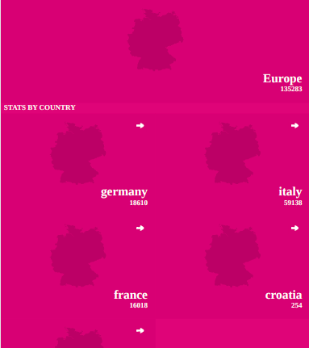
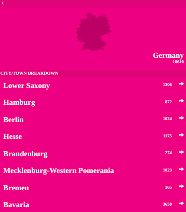

# Describtion

Corona Statisitics.

# Video Presentation
https://www.youtube.com/watch?v=pqE2OsOnVpY

# live Demo
 [Covid19](https://dazzling-franklin-970efc.netlify.app/)

# Home Page

| |
| :------------: |

# Description Page

| |
| :------------: |

## Installation

- Clone the repository , use  `git@github.com:Abdona/Covid19.git` 
- open terminal and change Directory, use `cd Covid19`
- Install all Dependencies, use `npm install` or `npm i`

## Usage

### Development server
- to run the Webapp you need to use `npm run start`

You can now view the development server at `localhost:3030`.

## Built With

- React.js
- Redux
- COVID-19 data API
- redux-thunk middleware

## Author

# 👤 Abdulrahman Naser
- GitHub: [@githubhandle](https://github.com/Abdona)
- LinkedIn: [LinkedIn](https://www.linkedin.com/in/abdulrahman-nasser-2b7173131/)

## 🤝 Contributing

Contributions, issues, and feature requests are welcome!

Feel free to check the [issues page](https://github.com/Abdona/Covid19/issues).

## Show your support

Give a ⭐️ if you like this project!

## Inspiration
Microverse

## 📝 License

This project is [MIT](./LICENSE) licensed.